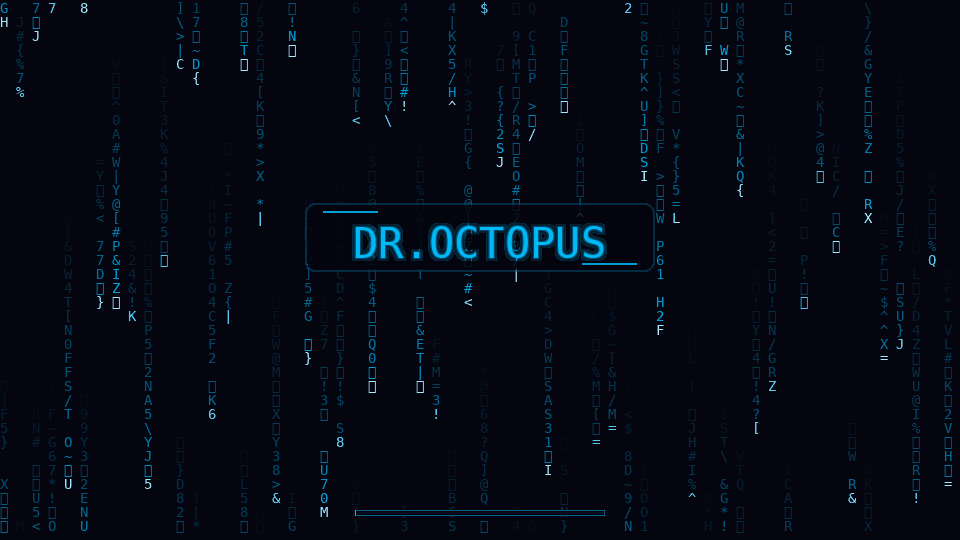

<div align="center">

# CipherBoot Plymouth Theme

### *A cinematic cipher-rain boot sequence for Linux*

[](LICENSE)
[](README.md)
[](docs/CONTRIBUTING.md)
[](docs/CONTRIBUTING.md)

<br>

*A cyberpunk-inspired Plymouth boot splash theme featuring neon cipher-rain animation, a compact progress bar, and installer support for Ubuntu-based and Arch-based distributions.*

<br>



<br>

</div>

---

## What Makes CipherBoot Different

| Capability | CipherBoot |
|---|---|
| Distro detection | Ubuntu and Arch family detection via `/etc/os-release` |
| Install flow | Theme install, Plymouth registration, initramfs rebuild |
| Variants | Neon default, plus ghost and cipher variants |
| Preview | Reliable frame preview, plus best-effort Plymouth desktop preview |
| Maintenance | Clean uninstall, GRUB backup, validation script |
| Assets | 48 generated PNG8 frames, about 1.8 MB total |

---

## Supported Distributions

CipherBoot automatically detects your distribution and configures itself accordingly.

### Ubuntu-based

| Distribution | Status | Target Version |
|---|---|---|
| **Ubuntu** | ✅ Supported install path | 22.04 / 24.04 |
| **Zorin OS** | ✅ Supported install path | 17.x |
| **Pop!\_OS** | ✅ Supported install path | 22.04 |
| **Linux Mint** | ✅ Supported install path | 21.x |
| **elementary OS** | ✅ Supported install path | 7.x |
| **Other Ubuntu derivatives** | ⚠️ Best effort | Community testing welcome |

### Arch-based

| Distribution | Status | Notes |
|---|---|---|
| **Arch Linux** | ✅ Supported install path | Requires `plymouth` from the extra repo |
| **EndeavourOS** | ✅ Supported install path | Community testing welcome |
| **Manjaro** | ✅ Supported install path | Community testing welcome |
| **Garuda Linux** | ✅ Supported install path | Community testing welcome |
| **CachyOS** | ✅ Supported install path | Community testing welcome |
| **Other Arch derivatives** | ⚠️ Best effort | Community testing welcome |

> **Don't see your distro?** Open an [issue](https://github.com/Atharva013/CipherBoot-Plymouth/issues) or submit a PR — contributions are very welcome!

---

## Quick Install

```bash
git clone https://github.com/Atharva013/CipherBoot-Plymouth
cd CipherBoot-Plymouth
chmod +x install.sh
sudo ./install.sh
```

Reboot to see the default neon variant.

The default install keeps the classic cipher-rain splash without a boot signature.

### Arch Linux Prerequisites

Plymouth is not installed by default on Arch. Install it first:

```bash
# From the official extra repository
sudo pacman -S plymouth
```

You also need to add `plymouth` to your `mkinitcpio` HOOKS (the install script handles this automatically, but if you prefer manual setup):

```bash
# In /etc/mkinitcpio.conf, add 'plymouth' after 'base' in the HOOKS array:
HOOKS=(base plymouth udev autodetect modconf block filesystems keyboard fsck)
```

Then run the installer as usual:

```bash
sudo ./install.sh
```

### Install Options

| Flag | Description |
|---|---|
| `--variant neon` | Install the default neon variant |
| `--variant ghost` | Install the ghost colour variant |
| `--variant cipher` | Install the teal cipher variant |
| `--signature` | Ask for a centered boot signature during install |
| `--signature "Dr. Octopus"` | Add a centered boot signature directly, max 16 characters |
| `--no-signature` | Explicitly install without a boot signature |
| `--no-grub` | Skip GRUB configuration (if you manage GRUB manually) |

---

## Preview Before You Install

Don't want to reboot just to check how it looks? We've got you:

```bash
chmod +x preview.sh
./preview.sh --simple
```

Simple preview opens a generated frame and is the most reliable option across X11, Wayland, and different desktop environments. Full Plymouth test mode is also available, but it depends on your display stack and usually needs `plymouth-x11`:

```bash
sudo apt install plymouth-x11   # Ubuntu/Zorin/Mint/elementary
sudo ./preview.sh
```

---

## Theme Variants

CipherBoot ships with **3 visual variants**. Choose during install or switch anytime:

| Variant | Description |
|---|---|
| `neon` | Default — high-contrast green-on-black terminal aesthetic |
| `ghost` | Soft cyan pulse with dark navy background |
| `cipher` | Teal cipher rain on deep black |

To switch variants after install:

```bash
sudo ./install.sh --variant ghost
```

Variant installs generate the matching frame/background/progress assets into a temporary directory, then copy those generated assets into the Plymouth theme directory.

---

## Boot Signature

CipherBoot can place a short name, handle, or machine label in the center of the splash:

```bash
sudo ./install.sh --signature
sudo ./install.sh --variant neon --signature "Dr. Octopus"
```

Plain `sudo ./install.sh` does not add a signature. Use `--signature` only when you want one.

The installer normalizes signatures to uppercase, supports letters, numbers, spaces, dots, hyphens, and underscores, and caps the text at 16 characters so it stays centered with comfortable side spacing.

---

## Uninstall

Revert cleanly to your distro's default splash screen:

```bash
chmod +x uninstall.sh
sudo ./uninstall.sh
```

No manual config edits needed. The script handles everything — restores your previous GRUB config, removes theme files, and rebuilds the initramfs.

---

## Project Structure

```
CipherBoot-Plymouth/
│
├── theme/                          # Core Plymouth theme files
│   ├── CipherBoot.plymouth         # Theme descriptor — cipher variant
│   ├── CipherBoot-ghost.plymouth   # Theme descriptor — ghost variant
│   ├── CipherBoot-neon.plymouth    # Theme descriptor — neon variant
│   ├── CipherBoot.script           # Animation logic (Plymouth scripting language)
│   └── assets/
│       ├── background.png          # Full-screen background image
│       ├── signature.png           # Optional centered boot signature overlay
│       ├── frames/                 # Animation frame PNGs (frame-0000.png → frame-0047.png)
│       └── progress/               # Progress bar sprites
│
├── scripts/
│   ├── generate_frames.py          # Python tool to regenerate/customise animation frames
│   ├── generate_preview.py         # Generate preview.gif from existing frames
│   └── detect_distro.sh            # Distro detection utility (used by install.sh)
│
├── docs/                           # Module documentation (development guide)
│   ├── MODULE_01_ASSETS.md
│   ├── MODULE_02_SCRIPT.md
│   ├── MODULE_03_CONFIG.md
│   ├── MODULE_04_INSTALL.md
│   ├── MODULE_05_UNINSTALL.md
│   ├── MODULE_06_PREVIEW.md
│   ├── MODULE_07_COMPATIBILITY.md
│   └── CONTRIBUTING.md
│
├── .github/
│   ├── ISSUE_TEMPLATE/
│   │   ├── bug_report.md
│   │   └── feature_request.md
│   └── PULL_REQUEST_TEMPLATE.md
│
├── install.sh                      # Main install script (Ubuntu + Arch)
├── uninstall.sh                    # Clean uninstall script (restores GRUB)
├── preview.sh                      # Live desktop preview (no reboot needed)
├── preview.gif                     # Animated demo (used in this README)
├── LICENSE                         # Apache 2.0 License
└── README.md                       # This file
```

---

## How It Works

CipherBoot uses a performance-optimised rendering pipeline:

1. **Frames are generated at half resolution** (960×540) and upscaled to your native resolution at runtime by Plymouth's scaler
2. **PNG8 palette mode** keeps the 48-frame animation small while giving the loop enough length to avoid a visible restart every couple of seconds
3. **Boot signatures** are rendered as a theme-colored overlay, keeping the name centered without covering the full screen
4. **GRUB is configured** to keep the framebuffer payload, enable `quiet splash`, and add early modesetting hints where appropriate
5. **Hybrid progress bar** smoothly interpolates between system-reported progress and a quick visual timer, so fast restarts still reach a complete bar before Plymouth exits
6. **Prompt and quit handling** keeps the theme visible through LUKS password prompts and leaves the final frame in place for the display-manager handoff where Plymouth/driver timing allows it. A short black screen can still appear on some systems while the kernel, GPU driver, and display manager negotiate ownership of the framebuffer.

---

## Customise It Yourself

Want to change the colours, text, or animation speed? The `scripts/generate_frames.py` tool lets you regenerate frames with your own parameters:

```bash
# Install dependencies
pip install pillow

# Generate all assets with custom colour
python3 scripts/generate_frames.py --all --color "#FF00FF"

# Generate with a specific variant preset
python3 scripts/generate_frames.py --all --variant ghost

# Reproducible output with a fixed seed
python3 scripts/generate_frames.py --all --seed 42
```

Then reinstall:

```bash
sudo ./install.sh
```

---

## Contributing

Found a bug? Want to add support for another distro? Have a new variant idea?

See [CONTRIBUTING.md](docs/CONTRIBUTING.md) for guidelines.

Quick contribution flow:
1. Fork the repo
2. Create a branch: `git checkout -b feature/your-feature-name`
3. Commit your changes
4. Open a Pull Request

All PRs are welcome — even documentation fixes!

---

## Reporting Issues

Please use the [GitHub Issues](https://github.com/Atharva013/CipherBoot-Plymouth/issues) tab with the appropriate template:

- **Bug Report** — theme not displaying, install failing, distro not detected
- **Feature Request** — new variant, new distro support, new option

---

## License

This project is licensed under the **Apache License 2.0** — see [LICENSE](LICENSE) for details.

Free to use, fork, and modify. Credit appreciated but not required.

---

## Acknowledgements

- The [Plymouth](https://www.freedesktop.org/wiki/Software/Plymouth/) project for the boot splash framework
- The Ubuntu, Arch Linux, and open-source communities for feedback and testing
- Everyone who tests, reports bugs, and submits PRs

---

<div align="center">

**CipherBoot** — open source, built for Linux desktop customisation.

Feedback, distro reports, and pull requests are welcome.

</div>
